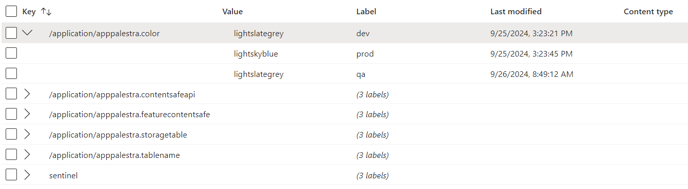
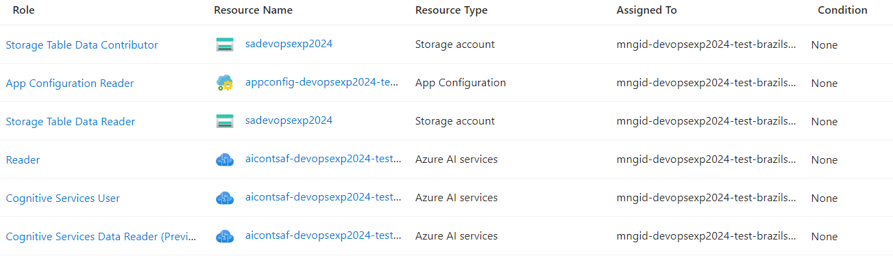

# DEVOPS HEROS SETEMBRO 2024 - Compreendendo o Azure Container Apps
## 26/09/2025

### Tecnologias

### Proposta
O Azure Container Apps é um serviço que simplifica a implantação de sistemas baseados na arquitetura de microservices utilizando de forma totalmente gerenciada no Kubernetes. A proposta desta palestra é apresentar as principais funcionalidades do Azure Container Apps.

### Slides
- [Download](slides/ContainerApps-Setembro-2024.pdf)

### Azure Services
- Storage Account
    - Duas Azure Tables PROD/DEV
- App Configuration
    
- Container Registry
- Content Safety
- Managed Identity
- Log Analytics workspaces
- Container App

### RBAC

